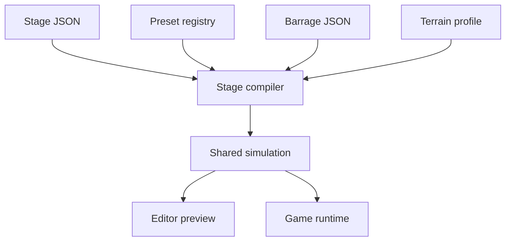

# Pixel Wave Stage Sequencer Roadmap v1

Status: M1 complete; M2 core editing/difficulty/turtle slice complete; M3 wave
authoring slice complete; M4 environment/special-system authoring complete;
M5 terrain review and terrain-object binding complete; M6 opt-in production
integration and parity bridge complete; M7 authoring hardening complete.
The shared scroll-curve, plugin-channel, runtime-state, and snapshot foundation
is complete. This
document orders the existing Stage JSON, preset registry, barrage runtime, and
terrain-profile designs into usable vertical releases. It does not authorize
changing current stage gameplay yet.

## 1. Product target

The Stage Sequencer is a mobile-first stage authoring application shaped like a
compact video editor.

The first complete version must let the designer:

- arrange enemies, paths, weapons, environment changes, gimmicks, hazards,
  terrain objects, cues, and bosses on one timeline;
- preview the full stage or a selected range;
- switch difficulty without duplicating the whole stage;
- change background scroll speed and stage-specific systems;
- reuse barrage JSON made in the existing Barrage Lab;
- save drafts locally and import or export Stage JSON;
- hand exported JSON to Codex for repository integration;
- produce the same result in preview and the game runtime.

The editor is not a second game engine. It is a visual authoring shell around
shared compiler and runtime modules.

## 2. Non-negotiable architecture

### 2.1 One behavior implementation

Movement, weapon, barrage, gimmick, hazard, and terrain behavior lives in
shared runtime modules. The editor may draw handles and forms from registry
metadata, but it may not implement a simplified copy of gameplay behavior.



### 2.2 Stage JSON is the authored source

There is no separate opaque project format. Timeline clips are projections of
`stage.items`; editing a clip edits that item.

Editor-only state is stored separately:

- selected item;
- playhead and range selection;
- timeline zoom and scroll;
- collapsed tracks;
- preferred difficulty and preview speed;
- open bottom-sheet height.

These values must not appear in exported Stage JSON or affect gameplay.

### 2.3 Deterministic preview

The same stage seed, difficulty, inputs, and elapsed time must produce the same
enemy, projectile, environment, and terrain state. Registry plugins therefore
need `snapshot` and `restore`; unseeded `Math.random()` is forbidden inside the
new runtime path.

### 2.4 Offline-first authoring

The static hosted editor remains useful without the development server:

- autosave drafts to IndexedDB;
- import and export JSON through the browser;
- cache the application shell as a PWA;
- recover the last draft after reload;
- show an explicit “not exported” warning for device-only work.

When `python server.py` is available, the same UI may save directly into the
repository through validated endpoints. Authentication or hosting is a
transport concern and must not alter Stage JSON.

## 3. What to reuse from Barrage Lab

The existing Barrage Lab already proves several required pieces:

| Existing capability | Stage Sequencer use |
|---|---|
| Shared `BarrageRuntime` | weapon pattern preview; no reimplementation |
| Local draft recovery | replace localStorage with IndexedDB for larger stages |
| JSON import/export and share sheet | same handoff workflow |
| PWA manifest and service worker | extend into a separate Sequencer app shell |
| Canvas transport controls | reuse behavior, not tightly coupled DOM code |
| Difficulty and speed selectors | common preview toolbar |
| Safe server save with temporary replace | basis for `/api/stages/<id>` |
| “Game에서 시험” | later range/stage test bridge |

Do not enlarge `barrage-editor.js` into the Stage Sequencer. Extract reusable
runtime and file utilities, then build a separate application. Barrage Lab stays
a focused pattern editor and can be opened from a weapon inspector.

## 4. Screen model

The selected mobile direction is preview-first, direct manipulation.

### Portrait

1. Top bar: back, stage name, validation state, save/export menu.
2. Preview: approximately 50–58% of available height when the sheet is closed.
3. Transport: play, current time, range toggle, difficulty, speed.
4. Compact timeline: ruler plus two to five visible tracks.
5. Contextual bottom sheet: selected item properties and advanced controls.

The bottom sheet has three stable positions: peek, half, and full. Dragging the
sheet must never drag a preview gizmo underneath it.

### Landscape and desktop

- Preview and timeline share the center.
- Library appears on the left.
- Inspector appears on the right.
- The same selection and command model is used; this is a layout change, not a
  separate editor.

### Primary track groups

| Group | Item types | Default behavior |
|---|---|---|
| Environment | `environment` | full-width lanes; curves visible on expansion |
| Gimmicks | `gimmick`, `hazard` | duration clips with type color |
| Enemies | `wave` | formation summary and resolved count badge |
| Terrain | `terrain-object` | distance clips projected onto current time |
| Cues | `cue` | marker or short clip |
| Boss | `boss` | locked final marker/clip |

Tracks are grouped views, not stored ownership. Moving an item between groups
changes its type only through an explicit conversion command.

## 5. Core editing model

### Selection

- One tap selects.
- Tap empty space clears.
- Long press enters multi-select.
- Preview and timeline share the same selection.
- Selecting an overlapping preview object cycles candidates through a small
  chooser instead of guessing.

### Time and distance

Most clips use time. Terrain objects use absolute layer distance. The timeline
projects distance to time using the currently resolved scroll curve.

Distance clips show a chain-link badge. Dragging one in time asks which intent
to preserve:

- **지형 위치 유지:** time projection changes only;
- **도착 시간 유지:** recalculate absolute layer distance.

The editor remembers the choice only for the current gesture. It must not hide
this distinction globally.

### Commands and undo

Every mutation is a command with forward and inverse JSON patches:

- add, delete, duplicate;
- move or resize clip;
- change field;
- reorder path point;
- apply difficulty override;
- approve or reject terrain socket;
- bulk shift selected items.

Slider and drag updates are coalesced from pointer-down to pointer-up into one
undo step. The initial target is 100 undo steps per document.

### Clipboard

Copy uses a small versioned JSON fragment, not a serialized DOM node. Pasting
regenerates colliding IDs and declares missing dependencies. Cross-stage paste
must show what will be added before committing.

## 6. Preview and seeking

### Playback modes

- **Full:** start from stage time zero and play through.
- **Range:** loop or play once between in/out points.
- **Selection:** isolate the selected wave, barrage, hazard, or gimmick while
  retaining required environment state.
- **Difficulty compare:** restart the same range with easy, normal, or hard.

Selection preview is a diagnostic mode. Full and range preview remain the
authority for interactions between clips.

### Snapshot cache

Seeking cannot resimulate a two-minute stage from zero on every scrub.

1. Build deterministic snapshots every five seconds during idle time.
2. Keep time zero, section starts, range-in, and the latest playhead snapshot.
3. On seek, restore the nearest earlier snapshot and simulate fixed steps to
   the requested time without rendering intermediate frames.
4. Invalidate snapshots at and after the earliest edited time.
5. Rebuild lazily so editing remains responsive.

The five-second interval is a starting value. The cache must obey a memory
budget and may evict least-recently-used snapshots except pinned section starts.

### Fixed simulation step

Preview simulation uses a fixed step independent of display frame rate. A
recommended starting point is `1/60 s`, with a capped number of catch-up steps.
The renderer may skip frames; simulation time may not skip behavior updates.

### Input recording

Initial stage preview uses a stationary or draggable test player. A later
optional input recording can replay one dodge route across difficulties, but it
is not required for the first usable release.

## 7. Difficulty authoring

The editor always shows a base lane plus an active difficulty overlay.

- Gray clip: inherited unchanged.
- Colored outline: patched for active difficulty.
- Solid colored clip: replacement payload.
- Struck-through clip: disabled.
- Plus marker: item exists only in this difficulty.

The inspector offers explicit operations:

1. inherit;
2. patch selected fields;
3. replace behavior;
4. disable;
5. promote active result to base.

Increasing enemy count is only one possible patch. A difficulty may replace
formation, movement, weapon, path, timing, or the entire item, and may add an
additional wave. The UI must show the resolved result and the underlying
override separately.

## 8. Validation UX

Validation runs after every committed command, not on every pointer-move event.

Severity:

- red: cannot preview or export as production;
- yellow: preview allowed, intentional review needed;
- blue: information such as derived duration or dependency addition.

The top bar shows the highest severity and count. Tapping it opens a list; each
entry seeks to the item and highlights the affected field or preview gizmo.

Export has two modes:

- **Draft JSON:** warnings and errors allowed, `draft: true` required;
- **Production JSON:** no errors, all profiles approved, dependencies resolved.

The editor never “fixes” unknown data by deleting it. Unsupported newer schema
versions open read-only with an explanation.

## 9. Saving and repository integration

### Browser storage

Use IndexedDB stores:

```text
documents     stage id -> normalized Stage JSON
drafts        stage id -> current dirty Stage JSON
editorState   stage id -> non-gameplay UI state
snapshots     stage id + revision + difficulty -> preview snapshots
```

Each draft carries a monotonically increasing local revision. Autosave occurs
after a short idle delay and immediately when the page becomes hidden.

### JSON export

Export performs normalize → validate → stable sort → pretty-print. Stable item
ordering is trigger position, type priority, then ID. This minimizes Git diffs.

Suggested filename:

```text
pixel-wave-stage3.v1.json
```

### Development server

Later extend `server.py` with:

```text
GET  /api/stages
GET  /api/stages/<id>
POST /api/stages/<id>
POST /api/stages/<id>/validate
```

Use the Barrage Lab's safe ID validation, 1 MB request limit, temporary file,
atomic replace, and rollback pattern. Successful save runs the stage build and
tests before confirming. A server endpoint may write only inside the configured
stage data directory.

## 10. Module boundary

Recommended final layout:

```text
js/stage/
  schema.js              common normalization and shape validation
  registry.js            preset/plugin/object metadata
  compiler.js            Stage JSON -> resolved schedule
  random.js              seeded random streams
  simulation.js          deterministic stage world
  snapshot.js            snapshot/restore orchestration
  layerTransform.js      background and terrain shared transform

tools/stage-sequencer/
  index.html
  app.js
  store.js               commands, selection, undo, revisions
  timeline.js
  preview.js
  inspector.js
  difficulty.js
  terrainReview.js
  persistence.js
  styles.css
  manifest.webmanifest
  service-worker.js

data/stages/
data/terrain-profiles/
data/terrain-overrides/
```

Exact filenames may change during implementation. The dependency direction may
not: `js/stage/` must not import from `tools/stage-sequencer/`.

## 11. Vertical implementation milestones

Each milestone ends in something usable on a phone. Do not build all panels
first and postpone preview correctness.

### M0 — Contracts and parity fixtures

Already designed:

- Stage JSON Schema v1;
- preset/plugin registry contract;
- full Stage 3 draft conversion;
- Stage 1 terrain, Stage 5 wreck, and Stage 6 storm coverage fixtures;
- Terrain Profile and overrides schemas.

M1 froze its Stage 3 subset in `js/stage/registry.js`. Carried forward before
the production runtime migration:

- add parameter schemas for those entries;
- define the `coral-turret` terrain object registry entry;
- choose the production `data/stages/` location.

Acceptance:

- all fixtures validate;
- current source parity fields report zero unintended mismatch;
- no game behavior changes.

### M1 — Read-only Stage 3 player

Build the compiler and a read-only mobile page that loads
`stage3.v1.draft.json`.

Scope:

- stage, registry, and dependency validation;
- deterministic Stage 3 waves;
- background and scroll curve;
- play/pause/restart, seek, speed, difficulty;
- compact read-only timeline;
- full and selected-range playback.

Acceptance:

- all 41 Stage 3 items appear at the intended positions;
- three difficulty resolutions can be restarted deterministically;
- seeking to the same time yields the same compiled state hash;
- portrait phone controls have 44 CSS pixel targets;
- preview stays attached to the current game coordinate system.

M1 deliberately excludes editing. Preview parity is proven before authoring can
create new data.

### M2 — Core timeline editing and JSON handoff

Scope:

- add, select, move, resize, duplicate, delete;
- track groups and contextual bottom sheet;
- generic registry-driven fields;
- command undo/redo;
- IndexedDB autosave and recovery;
- JSON import/export and stable formatting;
- live validation navigation.

Initially support environment, cue, and simple straight single-enemy wave
items. Other items remain visible but read-only.

Implemented follow-up slice:

- base versus active-difficulty patch authoring;
- per-difficulty disable and inheritance restore;
- active-difficulty-only wave creation and visible overlay states;
- Stage 3 turtle-ride timing, scroll, invulnerability, pearl trail, and pearl
  ring controls.

Acceptance:

- create a short valid stage entirely on a phone;
- reload without losing an unexported draft;
- export, reimport, and receive equivalent normalized JSON;
- 100 edit/undo cycles restore the original document hash;
- unsupported items survive round-trip unchanged.

### M3 — Wave, formation, path, and weapon authoring

Scope:

- enemy and entry library;
- formation handles and resolved-count preview;
- path point direct manipulation;
- movement and weapon inspector metadata;
- open a barrage pattern in Barrage Lab and return its ID;
- projectile/enemy budget overlay.

Implemented path, formation, library, movement/weapon metadata, Barrage Lab
round-trip, and active-budget slices:

- `custom-path` movement with native normalized Stage JSON points;
- shared path normalization, validation, easing, hold, and deterministic
  sampling in `js/stage/path.js`;
- numbered preview handles with desktop and portrait touch targets;
- direct point dragging coalesced into one undo command;
- point add/delete plus arrival-time, easing, and hold controls without raw
  normalized coordinate fields;
- base and active-difficulty path authoring through the existing patch model.
- shared formation normalization, validation, layout, and resolved-count rules
  in `js/stage/formation.js`;
- entry-direction selection and direct entry-height manipulation;
- direct V-spacing and wall-gap handles with portrait touch targets;
- V and wall parameter inspectors plus live resolved-enemy count feedback;
- base and active-difficulty formation gestures through the command model.
- shared enemy metadata for fish, jelly, ray, turret, lantern, viper, ghost,
  and big enemies, including Korean labels, descriptions, and creation defaults;
- all five legacy entry presets through shared normalization, validation, and
  compiler origin/direction rules in `js/stage/entry.js`;
- direction-aware V and wall layouts for horizontal, vertical, and diagonal
  entries, with X/Y-aware direct entry handles;
- automatic dependency declarations grouped into the same undo command as the
  wave edit or insertion.
- Korean registry metadata and contextual inspector fields for all five Stage 3
  movement presets and all four Stage 3 weapon presets;
- shared movement/weapon normalization and validation in
  `js/stage/behavior.js`;
- editable sine, enter/pause/exit, and U-turn parameters, including travel-axis
  pause targets and runtime-backed U-turn/exit motion;
- editable aimed/ring fire interval and first-shot delay plus ring base count;
- base and active-difficulty behavior authoring through the existing patch
  model, with atomic dependency declarations and undo;
- explicit death-shot preview limits because M3 does not simulate player
  collision, damage, or enemy death;
- existing-pattern and new-pattern handoff from the weapon inspector to Barrage
  Lab, returning to the original wave, scope, and difficulty;
- one-command pattern application with automatic `barragePatterns` dependency
  declaration and undo;
- shared `BarrageRuntime.Runner` execution, projectile updates, and serialized
  runner state in deterministic seek snapshots;
- shared fixed-step active enemy/projectile tracking with snapshot/restore;
- current and selected-range peak counts with their peak times, recalculated for
  difficulty, section, and custom IN/OUT changes;
- compact desktop/mobile overlay using initial warning/critical guidance of
  24/32 active enemies and 240/360 active enemy projectiles.

Acceptance:

- reproduce representative M1–M5 and M7 legacy waves without code edits;
- difficulty can change formation, movement, or weapon, not just count;
- a custom path remains editable without exposing raw normalized coordinates;
- Barrage JSON executes through the shared runtime.

### M4 — Environment and special-system authoring

Implemented first slice:

- one shared scroll-curve normalizer, validator, and sampler for compiler,
  simulation, and editor;
- direct graph manipulation with add/delete/select controls, coalesced undo,
  and base or active-difficulty authoring;
- initial plugin state-channel metadata for multiplicative scroll and exclusive
  player motion ownership;
- responsive 390×844 inspector coverage and unchanged Stage 3 simulation
  parity hashes.

Implemented second slice:

- metadata-driven inspectors and validation for darkness, storm current, wreck
  corridor, and lightning clips;
- Stage 5 and Stage 6 coverage-fixture loading with payload parity across all
  three difficulties;
- composable versus exclusive state-channel declarations, deterministic overlap
  analysis, warning clips, and buttons that select and seek to both owners;
- millisecond clip timing input for legacy obstacle durations such as 11.579s.

Implemented final slice:

- shared deterministic runtime state for scroll, darkness, storm current,
  invulnerability, lightning, and wreck corridors;
- snapshot/restore coverage inside active Stage 5 and Stage 6 plugin clips;
- deterministic storm-surface animation driven by stage time;
- canvas visualization for wreck geometry, current direction, lightning
  telegraph/strike phases, and darkness;
- background selection follows the fixture's stage preset instead of a fixed
  Stage 3 preview.

Scope:

- scroll-speed curves;
- generic plugin clips;
- turtle ride;
- wreck corridor;
- storm current and lightning;
- plugin state-channel conflict display;
- range snapshot and restore for every included plugin.

Acceptance:

- Stage 5 and Stage 6 coverage fixtures reproduce source values;
- background scroll changes are immediately visible;
- range preview restored inside an active gimmick matches full playback;
- conflicting exclusive state channels produce actionable validation.

### M5 — Terrain review and terrain objects

Implemented:

- deterministic bottom-connected structural mask and surface extraction for
  the 1440×128 Stage 1 near strip;
- placement-class support/depth/flatness/clearance scoring that does not accept
  narrow coral tips, plus a reproducible override sidecar;
- three explicitly reviewed coral-turret sockets and socket anchors in the
  Stage 1 coverage fixture;
- semantic profile/item validation and stale source/override hash checks;
- one shared strip/terrain layer transform used by the background renderer and
  terrain-object simulation;
- distance-to-time projection, snapshot-safe placement, and scroll-speed parity
  tests;
- cyan contour/socket review overlay with approve, exclude, and force controls;
- metadata-driven coral-turret inspector for approved socket, vertical offset,
  HP, and fire interval.

Scope:

- Stage 1 structural-mask generation;
- Terrain Profile generator and semantic lint;
- cyan contour and socket review overlay;
- approve, reject, patch, and force workflows;
- shared layer transform;
- coral turret placement and preview.

Acceptance:

- thin coral tips are not approved automatically;
- the six Stage 1 candidate sockets are explicit and reviewed, and five
  production turrets use them as distance-domain anchors;
- a turret remains attached during play, seek, scroll-speed changes, and wrap;
- changing the foreground asset hash blocks stale production export;
- overrides survive regeneration or fail with explicit orphan reports.

### M6 — Production game integration

Implemented:

- stable build from the Stage 3 authored JSON into `data/stages/` and a browser
  registry;
- opt-in adapter from compiled spawn/special events to existing `Enemy`, ride,
  warning, and boss entry behavior;
- debug-only `stageRuntime=data` selection with legacy as the immutable default;
- side-by-side ordered wave timing/count, ride, warning, and boss parity checks
  for all three difficulties;
- full-stage and selected-range browser test URLs, linked from the Sequencer;
- data-runtime/parity status in the game debug HUD;
- one-parameter rollback with no data migration.

Scope:

- generated stage registry;
- opt-in Stage 3 data-driven runtime path;
- side-by-side legacy/data parity diagnostics;
- game test bridge for full stage and selected range;
- staged conversion of other levels.

Acceptance:

- debug mode can choose legacy or data-driven Stage 3;
- item timing, resolved enemy counts, boss entry, and special-system events are
  compared automatically;
- production remains on the legacy path until parity is approved;
- rollback is one configuration change, not a data migration.

### M7 — Authoring hardening

Implemented:

- additive multi-select, atomic bulk shift/delete, and one-step undo;
- portable clipboard fragments with collision-safe IDs and dependency merging;
- reusable current-range section templates placed at the playhead;
- 44px touch controls, visible keyboard focus, pressed/selection semantics, and
  keyboard copy/paste/delete/history shortcuts;
- immediate synchronous recovery plus delayed IndexedDB/localStorage draft save,
  newest-copy recovery, quota reporting, and export-independent failure state;
- explicit unversioned v0 → v1 migration notice and newer-version refusal;
- tested divergent-history synchronization conflict records that preserve both
  local and remote versions; no hosted endpoint is required or enabled;
- a 2,000-item validation/compile/bulk-command regression fixture.

Scope:

- multi-select and bulk shift;
- clipboard fragments across stages;
- section templates;
- mobile performance and accessibility pass;
- crash recovery and storage quota handling;
- schema migration UI;
- optional hosted project synchronization.

Acceptance:

- no data loss after forced reload during a dirty edit;
- a large 2,000-item schema-limit stage remains navigable;
- keyboard, touch, and screen-reader basics work;
- hosted synchronization conflicts never overwrite both versions; export stays
  available regardless of sync state.

## 12. Performance budgets

Starting budgets for a mid-range mobile browser:

| Operation | Target |
|---|---:|
| Tap selection feedback | under 100 ms |
| Timeline drag frame | under 16.7 ms where possible |
| Committed edit validation | under 100 ms typical |
| Draft autosave | under 250 ms off main thread where possible |
| Seek within a five-second snapshot gap | under 300 ms |
| Initial editor shell after cache | under 2 s |
| Preview | 60 fps target, 30 fps graceful floor |

Heavy validation, stable serialization, and snapshot construction should use a
Web Worker once measurements show main-thread stalls. Do not add workers before
the module APIs are testable synchronously.

## 13. Test strategy

### Pure unit tests

- normalization and stable ordering;
- seeded random streams;
- difficulty patch/replace resolution;
- timing policies and derived durations;
- distance-to-time projection;
- command inverse patches;
- terrain coordinate transform and wrap;
- snapshot round-trip hashes.

### Fixture tests

- Stage 3 complete conversion;
- Stage 1 turret profile and sockets;
- Stage 5 wreck lifetimes;
- Stage 6 storm and lightning values;
- one item of every supported registry category;
- malformed, stale, and newer-version JSON.

### Browser interaction tests

- portrait touch drag with no accidental page scroll;
- bottom sheet and preview gesture exclusion;
- import/export round trip;
- offline draft recovery;
- undo after slider, path drag, duplicate, and delete;
- seek during active plugin state;
- difficulty switching invalidates the right snapshots.

### Visual checks

Use fixed seeds and playhead times to capture preview screenshots. Compare major
entity positions and overlays with a tolerance appropriate to pixel snapping;
do not rely only on fragile full-image equality for animated water effects.

## 14. Explicitly postponed

- collaborative simultaneous editing;
- arbitrary user-authored JavaScript plugins;
- a general visual scripting language;
- full boss AI choreography editing;
- background image painting;
- multiplayer replay testing;
- replacing Git with a custom publishing system.

These can be reconsidered after M6. None is required to make and ship a stage.

## 15. First implementation slice

When implementation begins, start with M1—not with draggable clips.

The first pull request should contain only:

1. shared seeded random and registry skeleton;
2. Stage JSON loader, normalizer, and compiler for the Stage 3 subset;
3. a read-only mobile preview page;
4. play, seek, difficulty, and range controls;
5. parity and deterministic-seek tests.

That slice proves the hardest promise: the timeline is showing the actual game,
not an animation that merely resembles it. Once that is true, M2 can safely
turn the same items into editable clips.
