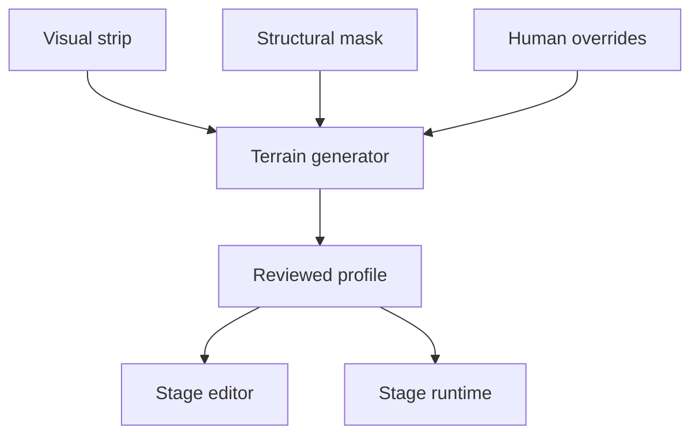

# Pixel Wave Terrain Profile v1

Status: design draft. This document defines how a foreground strip becomes
reviewable terrain data for the Stage Sequencer. It does not connect the
current game runtime yet.

Related files:

- `terrain-profile.schema.v1.json`: generated, reviewed profile shape
- `terrain-overrides.schema.v1.json`: human decisions preserved across rebuilds
- `stage.schema.v1.json`: stage items that reference a terrain profile

## 1. Decision summary

One terrain profile belongs to exactly one background preset layer and one
exact image revision.

The pipeline has two inputs:

1. A **structural mask** is preferred. It marks load-bearing rock while leaving
   decorative coral, grass, bubbles, and particles out of the geometry.
2. The visible image alpha is an allowed fallback. Its result is always marked
   `needs-review` because alpha cannot express whether an opaque pixel is rock
   or decoration.

The generated profile contains:

- one native-pixel floor sample and ceiling sample per strip column;
- placement rules evaluated for each object footprint class;
- generated or manually forced placement sockets;
- the hashes needed to detect stale geometry;
- an explicit review state.

The editor stores approvals, exclusions, forced sockets, and surface corrections
in a separate overrides file. Regeneration replaces derived data but never
silently discards human decisions.

## 2. Why alpha alone is insufficient

The current Stage 1 near strip is `1440×128`, uses binary alpha (`0` or `255`),
has matching wrap columns, and has an opaque bottom pixel in every column.
Those are good build invariants, but not enough to identify usable ground.

In the current image, the topmost opaque pixel ranges from Y=15 on tall coral
formations to Y=112 on the low reef. Thin coral branches and broad rock are in
the same bottom-connected alpha component. A test using the 16×14 turret's
whole visual width and strict two-pixel flatness found only a handful of broad
candidate spans. Relaxing it also admits decorative tips. There is no threshold
that can recover the missing semantic distinction.

Therefore:

- `structural-mask` is the production mode;
- `alpha-fallback` is a candidate generator, not an automatic authority;
- a reviewed hash is required before runtime use.

Stage 1 can produce a better structural mask inside
`tools/build_background_strips.py`: capture the load-bearing base before
`DECOR_CLUMPS`, then explicitly include only formations intended to support
gameplay objects. Future background builders should emit the mask alongside the
visual strip rather than attempting to reconstruct intent afterward.

## 3. File ownership and rebuild behavior

Recommended eventual locations:

```text
assets/backgrounds/stage1-near-strip.png
assets/backgrounds/stage1-near-terrain-mask.png
data/terrain-profiles/stage1-near-v1.json
data/terrain-overrides/stage1-near-v1.overrides.json
```

The profile is generated output. The overrides file is authored data.



Changing the visual strip, structural mask, generator configuration, placement
class, or override file regenerates the profile. An asset hash mismatch makes
the profile stale; it is never accepted on filename alone.

## 4. Coordinate spaces

### Profile space

Terrain samples and sockets use the source image's native pixels:

- origin: image top-left;
- positive X: right;
- positive Y: down;
- X wraps at image width;
- integer coordinates only.

For Stage 1 near, valid profile X is `0..1439` and Y is `0..127`.

### Stage distance space

A `terrain-object` keeps its absolute layer X in `timing.start`. This value is
in the game's logical 960×540 coordinate space, not native image pixels. It may
exceed one strip width so the same background motif can occur in later loops
without duplicating the object.

This preserves the existing migration equation:

```text
layer X = spawn X + source time × base scroll speed × layer parallax
```

For the current pixel renderer, `u = CFG.pxUnit = 2`. Let:

```text
layerScrollLogical = scrollDistance × background.scrollScale × layer.parallax
objectNativeX      = floor(timing.start / u)
scrollNativeX      = floor(layerScrollLogical / u)
profileX           = positiveMod(objectNativeX, stripWidth)
screenLogicalX     = (objectNativeX - scrollNativeX) × u
surfaceLogicalY    = (layer.baseline - image.height + profile.surfaceY[profileX]) × u
```

The renderer and terrain objects must call one shared layer-transform helper.
Reimplementing the rounding separately will eventually cause a one-pixel
jitter between the sprite and the foreground.

New editor placements are written on native-pixel boundaries, so
`timing.start` is normally a multiple of `u`. Imported fractional values remain
legal; rendering quantizes them with the formula above.

`anchor.offsetX` and `anchor.offsetY` are logical 960×540 pixels and are applied
after terrain sampling. Baseline, parallax, scroll scale, and opacity remain in
the background registry. They are deliberately not duplicated in the terrain
profile.

## 5. Profile structure

The binding prevents a valid profile from being used with the wrong art.

```json
{
  "format": "pixel-wave-terrain-profile",
  "schemaVersion": 1,
  "id": "stage1-near-v1",
  "name": "산호 초입 전경 지형",
  "binding": {
    "backgroundPresetId": "stage1",
    "layer": "near",
    "assetId": "background.stage1.near",
    "assetPath": "assets/backgrounds/stage1-near-strip.png",
    "assetSha256": "<64 lowercase hex characters>",
    "structuralMaskPath": "assets/backgrounds/stage1-near-terrain-mask.png",
    "structuralMaskSha256": "<64 lowercase hex characters>",
    "width": 1440,
    "height": 128
  },
  "coordinateSpace": {
    "unit": "native-pixel",
    "origin": "image-top-left",
    "xAxis": "right",
    "yAxis": "down",
    "wrapX": true
  },
  "surfaces": {
    "floor": { "samples": [110, 110, 109], "confidence": [1, 1, 1] },
    "ceiling": { "samples": [null, null, null], "confidence": [1, 1, 1] }
  },
  "placementClasses": [],
  "sockets": [],
  "generation": {
    "generatorId": "pixel-wave-terrain-generator",
    "generatorVersion": 1,
    "mode": "structural-mask",
    "alphaThreshold": 128,
    "connectivity": 4,
    "configurationSha256": "<64 lowercase hex characters>"
  },
  "review": {
    "status": "needs-review",
    "pendingSocketCount": 0
  }
}
```

The shortened sample arrays above illustrate the fields only. In a real
profile, every surface and confidence array has exactly `binding.width`
entries. JSON Schema cannot express that cross-field equality, so the semantic
validator enforces it.

Plain arrays are intentional in v1. A 1440-column strip is small, diffs are
inspectable, and the editor does not need a decompression format. Compression
can be added to transport without changing the authored JSON.

## 6. Surface extraction

The generator runs these deterministic steps.

### 6.1 Normalize and validate the mask

1. Load the structural mask when present; otherwise load visual alpha.
2. Convert `alpha >= alphaThreshold` to solid.
3. Verify width and height match the visual strip.
4. Verify first and last columns match.
5. Use four-neighbor connectivity by default.

### 6.2 Find outward-facing components

- Floor geometry is solid connected to the bottom image edge.
- Ceiling geometry is solid connected to the top image edge.
- Floating opaque islands are ignored and reported.

For each X:

- floor Y is the smallest Y in the bottom-connected solid;
- ceiling Y is the largest Y in the top-connected solid;
- missing geometry is `null`.

If one component touches both top and bottom, the profile is ambiguous and
requires review. If a future cave needs multiple stacked floors or ceilings in
one column, that requires surface bands in schema v2. V1 must warn rather than
silently choosing an interior ledge.

### 6.3 Assign confidence

Structural-mask samples start at confidence `1`. Alpha-fallback confidence is
reduced by narrow width, low solid depth, isolated spikes, sharp local changes,
and detached-component proximity. Confidence describes extraction certainty;
it does not itself make a point installable.

## 7. Placement classes and socket generation

An object registry entry supplies a placement class and its sprite contact
point. The generated profile embeds the evaluated class parameters so a review
can be reproduced exactly.

Initial `coral-turret-small` values should start from the current native
16×14 sprite but use its actual curved base rather than its full visual width:

```json
{
  "id": "coral-turret-small",
  "contactWidth": 10,
  "solidDepth": 4,
  "maxSurfaceDelta": 3,
  "minimumCoverage": 0.8,
  "minimumSpacing": 24,
  "minimumScore": 0.72,
  "clearance": { "left": 8, "right": 8, "outward": 14 }
}
```

These are review starting values, not accepted balance constants.

For every possible center X, the generator evaluates the wrapping footprint:

1. At least `minimumCoverage` of the contact width must have a surface.
2. Surface height range must not exceed `maxSurfaceDelta`.
3. The mask must remain solid for `solidDepth` pixels inward from contact.
4. The configured clearance rectangle must be empty outward from contact.
5. Floor normals must face generally upward; ceiling normals downward.

The deterministic score is:

```text
score =
  support coverage × 0.35
  + flatness       × 0.25
  + clearance      × 0.25
  + confidence     × 0.15
```

Contiguous valid centers form a candidate span. The generator selects the local
score maximum, then suppresses neighbors inside `minimumSpacing`. This gives the
mobile editor discrete, touch-friendly targets instead of hundreds of nearly
identical points.

Generated IDs are based on class, surface, and native X, for example
`coral-turret-small-floor-x00960`. They must not use array ordinals. A changed
X intentionally invalidates the old approval instead of accidentally applying
it to a different place.

## 8. Overrides and review

The overrides sidecar records five kinds of human decisions:

- `surfacePatches`: replace a run of extracted samples;
- `excludeRanges`: forbid sockets in a visual or gameplay-sensitive interval;
- `approvedSocketIds`: accept generated candidates;
- `excludedSocketIds`: reject individual candidates;
- `forcedSockets`: add a reviewed point the heuristic cannot recover.

Ranges crossing the wrap seam are written as two ranges. This keeps
`startX <= endX` and makes diffs unambiguous.

Regeneration order is fixed:

1. extract surfaces;
2. apply surface patches;
3. generate candidate sockets;
4. apply excluded ranges and IDs;
5. apply approvals;
6. add forced sockets;
7. compute review status and hashes.

If an approved ID disappears after regeneration, the build fails with an
orphaned-approval error. It is not silently dropped.

The editor review mode uses four states:

| Display | Meaning | Action |
|---|---|---|
| Yellow socket | generated, pending | tap to approve or reject |
| Green socket | approved or forced | valid runtime target |
| Red span | excluded | brush or tap to restore |
| Cyan contour | sampled support surface | drag to patch locally |

On mobile, selecting a socket opens the normal contextual bottom sheet with
score, support width, clearance, tags, and approve/reject controls. A
“지형 검토” toggle overlays the data without permanently covering the stage
preview.

## 9. Terrain object registry contract

`payload.objectId` resolves to a terrain object kind. This is separate from the
terrain profile because sprite geometry and behavior belong to the object, not
to one stage image.

```js
registerTerrainObject({
  id: 'coral-turret',
  version: 1,
  spriteId: 'enemy.turret',
  placementClassId: 'coral-turret-small',
  contacts: {
    floor: { x: 8, y: 14 }
  },
  render: { relativeToLayer: 'near', order: 'before' },
  paramsSchema: {},
  createState(context, item),
  update(context, state, dt),
  snapshot(state),
  restore(serializedState)
})
```

Contact points use native sprite pixels. For a floor socket, sprite top-left is:

```text
left = screenLogicalX - contact.x × u + anchor.offsetX
top  = surfaceLogicalY - contact.y × u + anchor.offsetY
```

Drawing the turret immediately before the near layer lets the foreground cover
the bottom contact pixels and visually embeds it in the reef. Other object
kinds may choose `after`, but ordering is a registry property, not a per-stage
free-form number.

A reviewed placement uses an explicit socket:

```json
{
  "type": "terrain-object",
  "timing": { "domain": "distance", "start": 2640, "duration": 0 },
  "payload": {
    "objectId": "coral-turret",
    "anchor": {
      "layer": "near",
      "surface": "socket",
      "socketId": "coral-turret-small-floor-x01320",
      "offsetX": 0,
      "offsetY": 0
    }
  }
}
```

The socket X must equal `positiveMod(floor(timing.start / u), stripWidth)`.
That semantic check prevents a copied socket ID from contradicting the item's
absolute layer position.

Direct `floor` or `ceiling` anchoring remains available for decorations and
objects whose registry explicitly allows continuous placement. Weapons and
solid structures such as the coral turret default to `socket`.

## 10. Editor drag and preview behavior

When the user drags a terrain object horizontally:

```text
absoluteNativeX = round(pointerLogicalX / u + scrollNativeX)
timing.start     = absoluteNativeX × u
profileX         = positiveMod(absoluteNativeX, stripWidth)
```

The editor queries approved sockets of the object's placement class near
`profileX` and the requested surface.

- Inside snap radius: show a green ghost at the best socket.
- Only pending socket nearby: show yellow and offer review.
- No valid socket: show red, keep the last valid placement, and explain the
  failed support or clearance rule.
- Vertical drag edits `offsetY`; it does not rewrite terrain samples.
- A separate review tool edits surfaces or forces sockets.

The preview must support both the full stage and a selected range. Range preview
restores the same scroll accumulator used by the background and the terrain
object transform, so seeking does not change attachment.

Changing background scroll speed changes when a distance item reaches the
screen, but does not change its absolute terrain position. When the user wants
to preserve screen-arrival time, the editor offers an explicit “시간 고정”
operation that recalculates distance. It must not do this silently.

## 11. Validation

JSON Schema validates shape. A semantic validator additionally rejects:

- surface or confidence array length different from image width;
- a non-null Y outside image height;
- source image or mask dimensions that differ from the binding;
- source or mask hash mismatch;
- first and last profile columns that break a seamless source boundary;
- duplicate socket IDs;
- socket class IDs missing from `placementClasses`;
- socket coordinates outside the profile;
- socket Y that disagrees with the selected surface without a forced override;
- an approved profile whose `reviewedAssetSha256` differs from `assetSha256`;
- `review.status: approved` with any pending socket;
- orphaned approvals or exclusions after regeneration;
- a runtime stage referencing a `needs-review` profile;
- a socket anchor whose layer, class, surface, or wrapped X does not match the
  terrain object and profile.

Warnings include:

- alpha-fallback generation;
- a long interval with no socket for a requested class;
- sharp wrap-seam normal change;
- floating components ignored during extraction;
- a component touching both top and bottom;
- direct surface placement of a damage-dealing or collidable object;
- a manually forced socket failing current support or clearance rules.

## 12. Edge cases

| Case | v1 behavior |
|---|---|
| Coral or grass shares alpha with rock | structural mask preferred; alpha result requires review |
| Broad tower top | allowed when the structural mask includes it and footprint checks pass |
| Thin branch tip | rejected by contact width, depth, and clearance |
| No ceiling in current strip | ceiling samples are all `null` |
| Cave with several stacked ledges | warn; use separate layer/profile or wait for v2 surface bands |
| Strip wrap boundary | sample modulo width; validate matching edge surface and normal |
| Background art rebuilt | hash mismatch blocks runtime until regeneration and review |
| Parallax or baseline changed | no profile rebuild; background transform changes centrally |
| Same motif on a later loop | same profile X, different absolute `timing.start` |
| Artist wants an exceptional location | forced socket with reason; warning remains visible |

## 13. Adoption order

1. **Contract only:** accept these schemas and add terrain-object registry
   metadata. No current gameplay changes.
2. **Generator:** emit Stage 1 near structural mask and draft profile; add hash,
   width, seam, and semantic validation to background lint.
3. **Review tool:** add the terrain overlay and approve/reject/force workflow to
   the Stage Sequencer.
4. **Stage 1 fixture:** review sockets, then replace the three draft
   `surface: floor` anchors with explicit socket IDs. Small X changes are allowed
   because visible terrain attachment is the purpose of this migration.
5. **Runtime binding:** centralize the layer transform and render terrain
   objects from approved profiles.
6. **Other stages:** generate profiles only for layers that actually host
   terrain objects; do not create unused geometry for every background.

Stage 1 is the acceptance test because it contains both low reef and tall
decorative formations. A successful implementation must keep a turret attached
through scrolling, seeking, speed changes, and strip wrap while rejecting thin
coral tips.

## 14. Deferred from v1

- arbitrary polygon collision exported from background art;
- stacked surface bands in one column;
- automatic semantic classification of decorative versus structural pixels;
- rotated sprites fitted to surface normals;
- deforming terrain;
- editing the visual background image from the Stage Sequencer.
